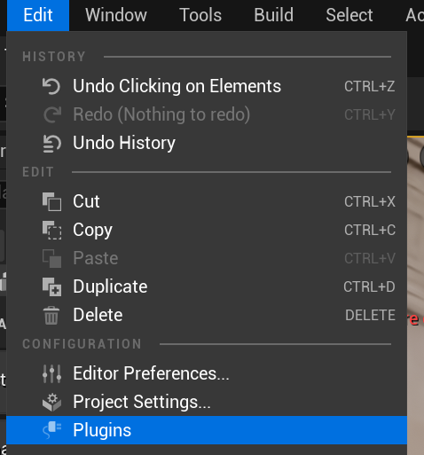
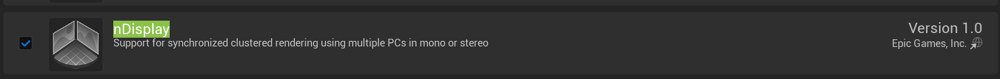
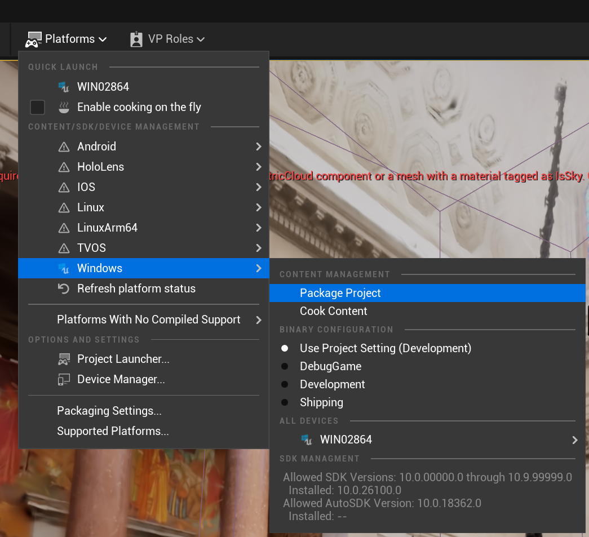

# About
To run a built Unreal project in either the Dome and the VR Arena, it must be built with nDisplay enabled. This can cause problems with some Unreal version and give "Unknown Error" when packaging the project. Unreal 5.5 and later seem to be safer than previous versions.

# Settings
Open Edit>Plugins and search for "nDisplay".

 Enable nDisplay and restart Unreal. With this setting enabled, nDisplay will hopefully pick up the camera in the scene when you run it on a cluster.

# Omnidirectional Stereo.
When you are done editing your project build it by clicking Platforms>Package Project>Package Project or Platforms>Windows>Package Project depending on Unreal version.

