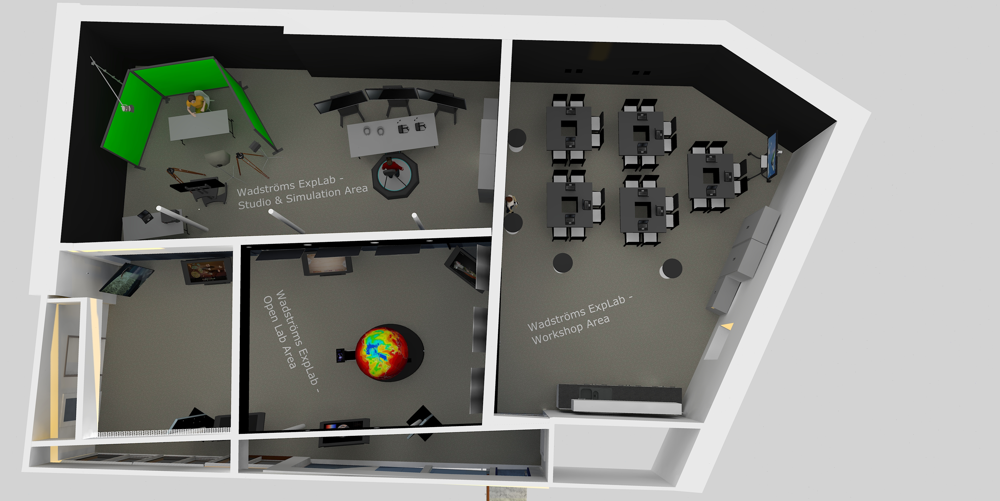

# The concept

The word *Exploranation* is a merger of explore and explanation, and this is what makes Wadströms Exploranation Laboratory unique. On active screens, a globe and a number of visualization tables, visitors have access to facts in areas related to sustainability, for instance climate, biodiversity, marine environments and not least, how we live, eat and exist.

## Experience in three steps
The first step is about experiencing, absorbing correlations and seeing the big pictures.
The next step involves a guide, where even more data can be accessed, and the questions that are answered are increasingly tricky.
In the third step, for instance, pupils in and upper secondary class can create their own research projects, and with the assistance of the enormous data volumes that are accessible, can discover completely new correlations and create presentation to show to their classmates and teachers in the vast dome theatre of the Visualization Center C. There are also computers and a recording studio for the pupils to use.

A laboratory of this type cannot be built without long-term funding; in this case the funding comes from the Stig Wadström Foundation.
“Stig Wadström was very interested in technology and innovative solutions. This campus is located on the site where the Wadström family’s textile mill once flourished, and we are convinced that Stig would have appreciated that his name will live on in the form of a laboratory where young people can develop their interest in science and technology”, says Robert Willén, chairman of the Stig Wadström Foundation.

More donations are welcome. The Noss Foundation is funding the development of an installation about biodiversity. The Swedbank Foundation for Scientific Research has made a donation for the establishment of a laboratory in Norrköping, and the Knut and Alice Wallenberg Foundation is funding a ten-year visiting professorship in Exploranation, or visual science communication, at Linköping University.