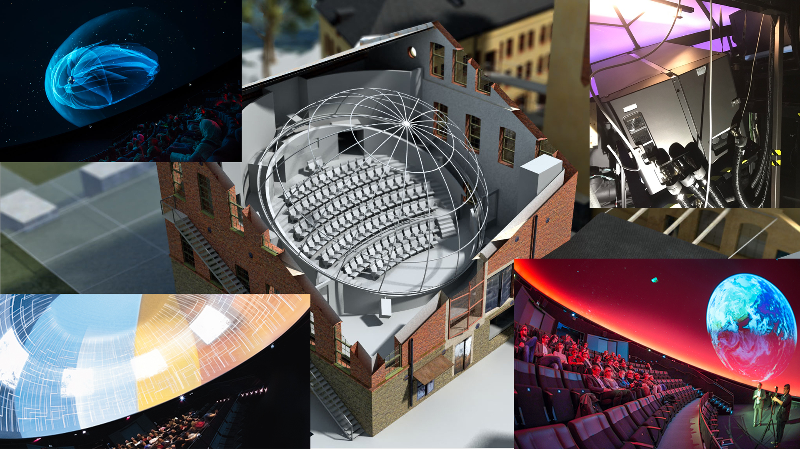
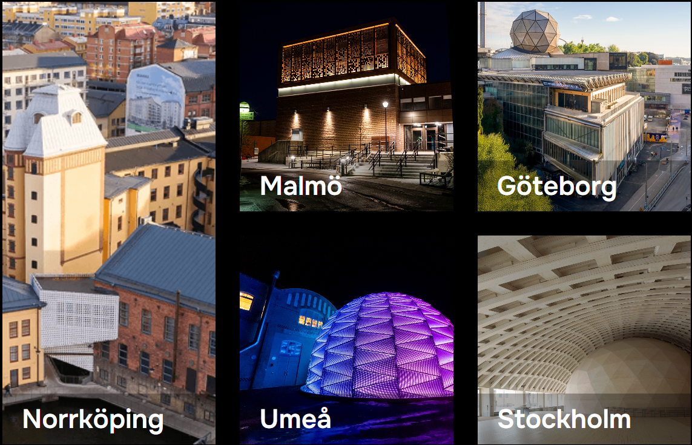

Our dome theater and our lab and learning environments in Norrköping’s industrial landscape were unique for a long time. Through the Wisdome project, we have been able to spread the technology and knowledge to other leading science centers in Sweden. The internationally ground-breaking visualization technology developed at Linköping University allows us to see what would otherwise be hidden from view, and creates understanding of complex interrelationships, large abstract volumes of data, and phenomena that are too small, too large, too quick or too slow for humans to grasp.

Our impressive 3D dome is state-of-the-art with current specifications:
* **First 6P Laser system in a dome**
* 6 x Barco XDL-4K30, up to 30 000 Lumens, 4K @ 120 Hz per projector
* Dolby 3D (6P Color Separation)
* NVIDIA GPU Clusters (Up to 4, i.e. 30 PC:s, running Ada 6000 and RTX 8000 GPU:s)
* 7.2 Audio System

Based on the world-leading research conducted at Visualiseringscenter C, and with contributions from the Knut and Alice Wallenberg Foundation, we have been able to create experiences and make complex research accessible in more places. Wisdome makes the invisible visible and takes us to places that are otherwise impossible to visit. Now, Wisdome dome theaters are in five cities, with Wisdome Norrköping as the mothership.

